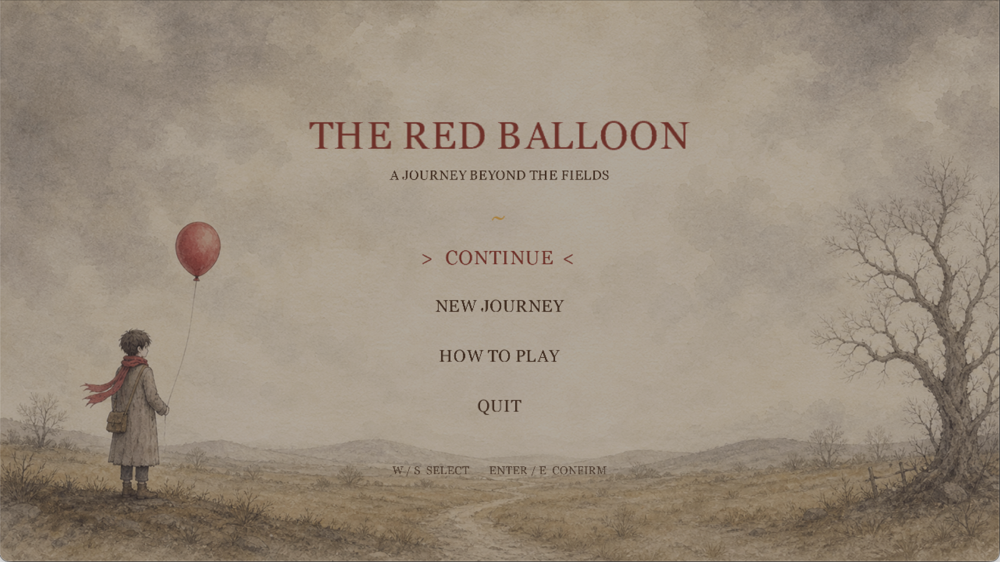
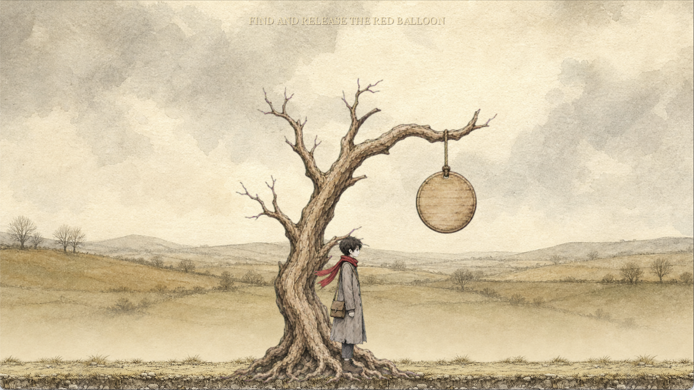
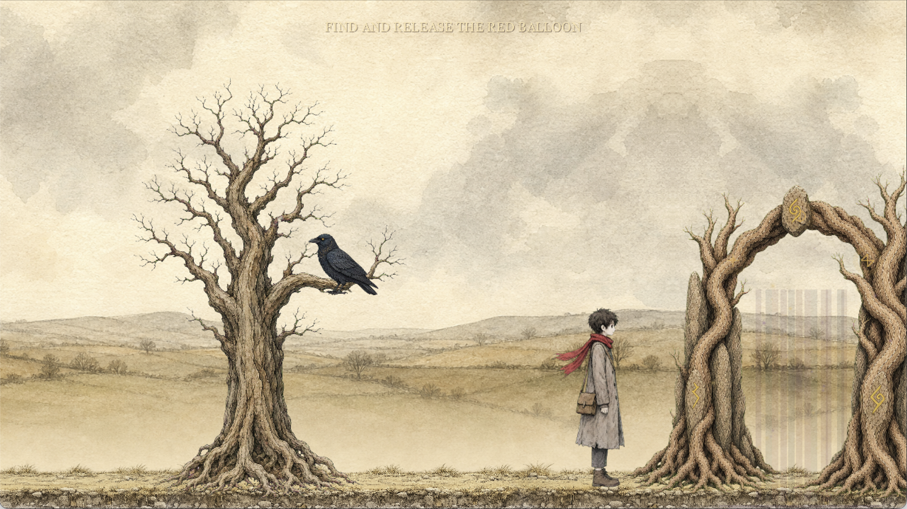

<p align="center">
  
</p>

<h1 align="center">The Red Balloon</h1>

<p align="center"><em>A journey beyond the fields.</em></p>

<p align="center">
  
  
  
</p>

<p align="center">
  <strong><a href="https://github.com/hanifb1360/the-red-balloon-releases/releases/latest/download/The-Red-Balloon-macOS-arm64.zip">Download for macOS</a></strong>
  ·
  <a href="https://github.com/hanifb1360/the-red-balloon-releases/releases/latest">Release notes</a>
</p>

---

**The Red Balloon** is a short, atmospheric 2D narrative puzzle game set in a fading illustrated world. Follow a quiet traveler across forgotten fields, read the signs left by an older language, face the things waiting beyond the gate, and discover where the red balloon is trying to lead you.

Built in C# with MonoGame, the game combines hand-painted watercolor environments, exploration, environmental puzzles, animated encounters, and an original soundscape.

## Screenshots

<p align="center">
  
</p>

| The Field of Echoes | The old gateway |
|:---:|:---:|
|  |  |

## What awaits

- Two connected hand-painted chapters, each with its own atmosphere and soundscape
- Environmental puzzles and compact gameplay challenges
- A mysterious red balloon that quietly guides the journey
- Animated creatures, spectral encounters, fog, particles, and ancient gateways
- Automatic progress saving and a complete narrative ending
- Keyboard-first controls, pause menu, fullscreen mode, and adjustable audio

## Download and install

The current build supports **Apple Silicon Macs running macOS 12 or newer**. It is self-contained, so .NET and MonoGame do not need to be installed.

1. [Download the latest macOS build](https://github.com/hanifb1360/the-red-balloon-releases/releases/latest/download/The-Red-Balloon-macOS-arm64.zip).
2. Unzip `The-Red-Balloon-macOS-arm64.zip`.
3. Drag **The Red Balloon.app** into **Applications**.
4. Because this independently distributed build is not yet notarized, Control-click the app the first time, choose **Open**, then confirm **Open**.

## Controls

| Action | Key |
| --- | --- |
| Walk | `A` / `D` or arrow keys |
| Jump | `Space` |
| Interact / confirm | `E` or `Enter` |
| Pause / back | `Esc` |
| Fullscreen | `F11` or `Option` + `Enter` |

## Verify the download

Every release includes a `.sha256` checksum. Place it beside the downloaded archive, open Terminal in that folder, and run:

```bash
shasum -a 256 -c The-Red-Balloon-macOS-arm64.sha256
```

## About this repository

This public repository is the official home of downloadable releases and presentation material for **The Red Balloon**. The game's source repository remains private.

Promotional cover artwork was created specifically for this release page using the game's original character, balloon, and environment artwork as visual references. Screenshots are captured from the game itself.

Copyright © 2026 Hanif Bahari. All rights reserved.
